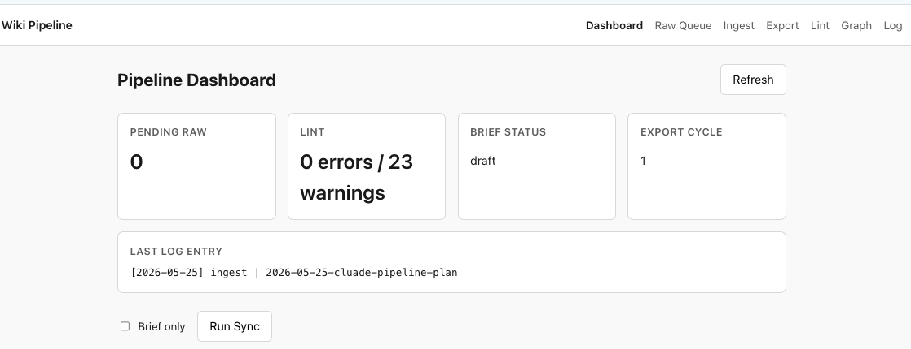

# Distill-Wiki-Pipeline

Multi-LLM research pipeline: collect LLM chat outputs, distill them into a compounding wiki, lint for contradictions, and export synthesis briefs for agentic development.

Based on [Karpathy's LLM Wiki pattern](https://gist.github.com/karpathy/442a6bf555914893e9891c11519de94f). See [`wiki/README.md`](wiki/README.md) for wiki submodule documentation.



## What this repo is

```
distill-wiki-pipeline/
├── docs/
│   ├── PROJECT_BRIEF.md              # synced synthesis for dev handoff
│   ├── RESEARCH_THESIS.md            # optional running research view
│   └── WIKI_PIPELINE_OPERATOR.md     # operator setup, CLI, MCP
├── pipeline/                         # wiki pipeline operator (CLI + API + UI + MCP)
├── scripts/
│   ├── sync-wiki-docs.sh             # copy wiki exports → docs/
│   └── wiki-pipeline                 # pipeline CLI entrypoint
├── wiki/                             # project-wiki git submodule
└── src/                              # application code (future)
```

**North-star:** can a coding agent implement correctly from the exported context?

Research and building run in parallel — ingest, lint, and re-export as the project evolves. This is not a one-time handoff.

## Two ways to operate the pipeline

| Mode | When to use |
|------|-------------|
| **Wiki Pipeline Operator** (recommended) | Local web UI + CLI — ingest, lint, export, sync without Cursor |
| **Cursor skills** (optional) | `/wiki-ingest`, `/wiki-lint`, `/wiki-export-brief` in the wiki submodule |

Both follow the same `wiki/AGENTS.md` schema and human approval gates.

## Quick start — Wiki Pipeline Operator

### Prerequisites

- Python 3.11+
- Node.js 20+
- [Ollama](https://ollama.com/) with `qwen2.5:7b-instruct` (default model)

### Clone with submodule

```bash
git clone --recurse-submodules <repo-url>
# or, if already cloned:
git submodule update --init --recursive
```

### Setup

```bash
cd pipeline
python3 -m venv venv && source venv/bin/activate
pip install -e ".[dev]"
cd ui && npm install && cd ../..

ollama pull qwen2.5:7b-instruct
```

### Run

```bash
# Terminal 1 — API (localhost:8787)
./scripts/wiki-pipeline serve

# Terminal 2 — UI (localhost:5173)
cd pipeline/ui && npm run dev
```

Open the UI for dashboard, ingest wizard, export, lint, graph, and sync.

See [`pipeline/README.md`](pipeline/README.md) for workflow details and [`docs/WIKI_PIPELINE_OPERATOR.md`](docs/WIKI_PIPELINE_OPERATOR.md) for full operator docs.

### CLI essentials

```bash
./scripts/wiki-pipeline status
./scripts/wiki-pipeline lint
./scripts/wiki-pipeline sync
./scripts/wiki-pipeline mcp      # MCP sidecar for external agents
./scripts/wiki-pipeline watch    # notify on pending raw files
```

## Research loop (Cursor skills alternative)

In `wiki/` with Cursor:

1. **Collect** — paste LLM chats into `wiki/raw/llm/` (AGENTS.md frontmatter)
2. **Ingest** — `/wiki-ingest` one file at a time
3. **Lint** — `/wiki-lint` after every 3–5 ingests
4. **Export** — `/wiki-export-brief`
5. **Sync** — `./scripts/sync-wiki-docs.sh`
6. **Build** — use `docs/PROJECT_BRIEF.md` for planning and implementation

## Sync wiki → docs

After exporting synthesis in the wiki submodule:

```bash
./scripts/sync-wiki-docs.sh              # PROJECT_BRIEF + RESEARCH_THESIS
./scripts/sync-wiki-docs.sh --brief-only # PROJECT_BRIEF only
```

Or use **Sync** in the pipeline UI / `./scripts/wiki-pipeline sync`.

Commit both repos after syncing:

```bash
cd wiki && git add -A && git commit -m "export brief cycle N" && cd ..
git add docs/ wiki
git commit -m "sync research synthesis"
```

## Where to read what

| Document | Purpose |
|----------|---------|
| [`pipeline/README.md`](pipeline/README.md) | Pipeline workflow and architecture |
| [`docs/WIKI_PIPELINE_OPERATOR.md`](docs/WIKI_PIPELINE_OPERATOR.md) | Operator setup, CLI, MCP, cron |
| [`docs/superpowers/specs/2026-05-25-wiki-pipeline-operator-design.md`](docs/superpowers/specs/2026-05-25-wiki-pipeline-operator-design.md) | Design spec |
| [`docs/PROJECT_BRIEF.md`](docs/PROJECT_BRIEF.md) | Primary dev handoff |
| [`docs/RESEARCH_THESIS.md`](docs/RESEARCH_THESIS.md) | Running synthesis |
| [`wiki/AGENTS.md`](wiki/AGENTS.md) | Wiki schema and workflows |
| [`wiki/wiki/index.md`](wiki/wiki/index.md) | Catalog of sources and concepts |

## Cursor skills (wiki submodule)

| Skill | Trigger |
|-------|---------|
| `wiki-ingest` | Process one raw source into the wiki |
| `wiki-lint` | Health-check contradictions, orphans, index sync |
| `wiki-export-brief` | Generate `project-brief.md` from synthesis |
| `wiki-query` | Ask questions against ingested research |

## Notes

- **Do not gitignore `wiki/`** — it is a tracked submodule.
- Raw files need AGENTS.md frontmatter with `status: pending` before ingest.
- Approve exported briefs (`status: current`) before treating `docs/PROJECT_BRIEF.md` as canonical.
- Default LLM model: `qwen2.5:7b-instruct` via Ollama (`pipeline/config.yaml`).
