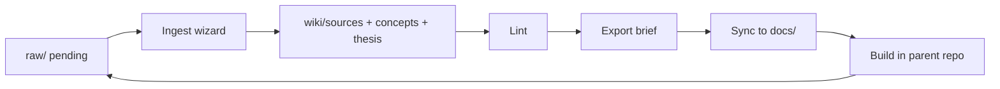

# Wiki Pipeline Operator

Local operator for the LLM-Wiki ETL loop: **collect → ingest → lint → export → sync**. Runs independently of Cursor via CLI, web UI, and MCP.

Full setup and CLI reference: [`docs/WIKI_PIPELINE_OPERATOR.md`](../docs/WIKI_PIPELINE_OPERATOR.md)

## Architecture

```
pipeline/
├── config.yaml              # wiki paths, Ollama model, server port
├── pipeline/
│   ├── wiki_core/           # shared library — paths, fs, lint, status, sync, graph
│   ├── llm/                 # Ollama router + ingest/export workflows
│   ├── workflows/           # auto pipeline orchestration (pre-approved)
│   ├── api/                 # FastAPI HTTP + job orchestration
│   ├── mcp/                 # MCP stdio sidecar (same wiki_core)
│   └── cli/                 # Typer CLI
├── ui/                      # Vite + React operator dashboard
└── tests/
```

**Principle:** `wiki_core` is the single source of truth. CLI, API, MCP, and LLM workflows all call into it.

## Workflow



### 1. Collect

Drop markdown files into `wiki/raw/llm/` or `wiki/raw/web/`. The auto pipeline will inject missing frontmatter (status, source, topic, date) automatically — no YAML required.

Upload via the UI **Raw Queue** form or paste files manually.

### 2. Ingest (human gates)

One raw file per job, two LLM passes with approval between stages:

| Stage | What happens |
|-------|----------------|
| Analyze | Ollama structural analysis (no writes) |
| Review | Operator approves analysis in UI |
| Draft | Ollama generates source page, concept updates, thesis delta |
| Review | Operator approves draft (optional edits) |
| Confirm | Writes wiki files; sets raw `status: ingested` |

**CLI:** `wiki-pipeline serve` (from `pipeline/` with venv active) + UI at `/ingest`

**API:** `POST /api/jobs/ingest` → approve-analysis → approve-draft → confirm

**Auto (pre-approved):** `wiki-pipeline auto --file <path>` — see [auto pipeline](#7-auto-pipeline-pre-approved) below

### 3. Lint

Deterministic checks (no LLM): pending raw, missing wikilinks, orphan pages, index sync.

```bash
wiki-pipeline lint
wiki-pipeline lint --json
```

UI: **Lint** page (`/lint`)

### 4. Export brief

Lint gate → Ollama draft of `wiki/synthesis/project-brief.md` → operator approval → promote to `status: current`.

UI: **Export** page (`/export`)

### 5. Sync to parent

Copy synthesis into parent `docs/`:

```bash
wiki-pipeline sync
wiki-pipeline sync --brief-only
```

Warns if brief is still `status: draft`.

### 6. MCP (optional)

Expose read-heavy tools to Cursor / Claude Desktop without opening the UI:

```bash
wiki-pipeline mcp
```

Tools: `wiki_list_pending`, `wiki_read_page`, `wiki_search`, `wiki_get_status`, `wiki_run_lint`, `wiki_sync_brief`

MCP is **read-heavy** — ingest and export still require the web UI or the [auto pipeline](#7-auto-pipeline-pre-approved).

### 7. Auto pipeline (pre-approved)

Run the full pipeline without any human gates — drop a file and walk away:

```bash
# Process one file
wiki-pipeline auto --file wiki/raw/llm/chat-export.md

# Process all pending files
wiki-pipeline auto --all

# Watch for new files and process them as they appear
wiki-pipeline auto --watch
```

The auto pipeline chains: **ingest → lint → export → lint → graph → sync**.

**Key features:**

- **Zero frontmatter required** — files dumped into `raw/` without YAML frontmatter get it auto-injected. The pipeline derives `source`/`type` from the directory (`raw/llm/` vs `raw/web/`), `topic` from the first H1 heading, and `date` from today.
- **Error resilient** — if an LLM call fails (e.g. Ollama returns bad JSON), that file is marked failed and the batch continues to the next file. The pipeline doesn't crash on a single bad response.
- **Export deferred** — export runs only after all pending raw files are ingested, so the project brief captures the complete picture.

See [`docs/WIKI_PIPELINE_OPERATOR.md`](../docs/WIKI_PIPELINE_OPERATOR.md) for full details.

## Quick start

```bash
# Setup (once)
cd pipeline
python3 -m venv venv && source venv/bin/activate
pip install -e ".[dev]"
cd ui && npm install && cd ../..

# Ensure Ollama is running with the configured model
ollama pull qwen2.5:7b-instruct

# Run (venv active)
wiki-pipeline serve                    # API :8787
cd pipeline/ui && npm run dev          # UI :5173

# Or auto-pipeline (no UI needed)
wiki-pipeline auto --all               # process everything pending
```

## Configuration

Edit `config.yaml`:

| Key | Default | Purpose |
|-----|---------|---------|
| `wiki_root` | `../wiki` | Wiki submodule path |
| `llm.models.ollama` | `qwen2.5:7b-instruct` | Model for ingest/export (local Qwen 2.5 7B) |
| `llm.ollama_base_url` | `http://localhost:11434` | Ollama API |
| `server.port` | `8787` | FastAPI bind port |

## CLI commands

| Command | Description |
|---------|-------------|
| `status` | Pipeline health summary |
| `lint [--json]` | Deterministic lint report |
| `sync [--brief-only]` | Sync wiki synthesis → `docs/` |
| `serve` | Start FastAPI server |
| `mcp` | Start MCP stdio server |
| `watch [--interval N]` | Notify when pending raw files exist |
| `auto --file PATH \| --all \| --watch` | Run full pipeline with pre-approval |

Entry point: `wiki-pipeline` (installed via `pip install -e .` in venv).
